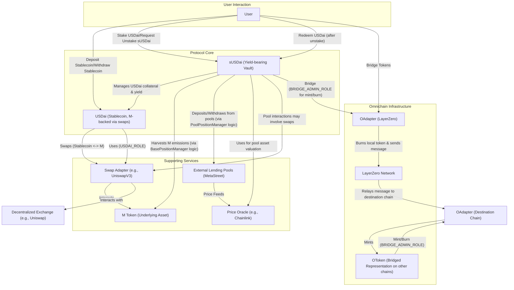

```
# MetaStreet USDai Protocol Documentation

## 1. Architectural Overview

The MetaStreet USDai protocol revolves around two primary tokens, USDai and sUSDai, and a suite of contracts that manage their lifecycle, yield generation, and cross-chain capabilities.

*   **Core Tokens:**
    *   **USDai (`USDai.sol`):** An ERC20 stablecoin backed by an underlying asset "M" (referred to as `_baseToken` in the `USDai` contract, which is obtained from the `SwapAdapter`). Users can mint USDai by depositing whitelisted stablecoins, which are then swapped for M via a `SwapAdapter`. Conversely, users can burn USDai to withdraw whitelisted stablecoins, with M being swapped back. The `USDai` contract itself does not hold M directly for backing; rather, it orchestrates the swaps and mints/burns USDai based on the M obtained or provided.
    *   **sUSDai (`StakedUSDai.sol`):** An ERC4626 and ERC7540 compliant yield-bearing vault token. Users stake USDai into the `StakedUSDai` contract to receive sUSDai shares. sUSDai accrues yield from two primary sources:
        1.  M emissions from the M held by the `USDai` contract (managed via `BasePositionManager` logic within `StakedUSDai`).
        2.  Lending activities in MetaStreet pools (managed via `PoolPositionManager` logic within `StakedUSDai`).
        Unstaking sUSDai for USDai is an asynchronous process involving a redemption queue and a timelock.

*   **Key Supporting Contracts and Components:**
    *   **Swap Adapter (`UniswapV3SwapAdapter.sol`):** A contract responsible for swapping between the base asset M and other whitelisted stablecoins. The current implementation uses Uniswap V3. It is called by `USDai` during minting/burning and by `StakedUSDai` (via `PoolPositionManager`) when interacting with pools that might use different currencies.
    *   **Position Managers (logic embedded within `StakedUSDai.sol`):**
        *   **`BasePositionManager` Logic:** Manages the yield generated from M. It claims accrued M yield (emissions) which can then be converted to USDai to increase the value of sUSDai shares. The M that generates this yield is notionally the M that backs USDai.
        *   **`PoolPositionManager` Logic:** Manages the investment of USDai into external MetaStreet lending pools. It handles depositing USDai (which might involve swapping M to the pool's currency) into these pools and withdrawing from them. Yield from these pools also contributes to sUSDai's value.
    *   **Price Oracle (`ChainlinkPriceOracle.sol`):** Used by `StakedUSDai` (specifically the `PoolPositionManager` logic) to determine the value of assets held in various lending pools, especially when those pools operate with currencies other than USDai or M. This is crucial for accurately calculating the Net Asset Value (NAV) of sUSDai and thus its share price. It derives prices relative to the M NAV.
    *   **Omnichain Components:**
        *   **`OAdapter.sol`:** A LayerZero OApp (Omnichain Application) that facilitates the bridging of tokens (USDai or sUSDai) to other chains. It handles the burning of tokens on the source chain and messaging LayerZero to mint tokens on the destination chain. It includes rate-limiting features.
        *   **`OToken.sol`:** An ERC20 token contract that represents the bridged version of USDai or sUSDai on a destination chain. It allows minting and burning by a `BRIDGE_ADMIN_ROLE` (typically the `OAdapter` on that chain or a similar bridging mechanism).

*   **Roles and Permissions:**
    *   **`DEFAULT_ADMIN_ROLE`:** Has administrative privileges over contracts, like setting parameters or upgrading.
    *   **`BRIDGE_ADMIN_ROLE`:** Granted to omnichain components (`OAdapter` or `OToken`) to mint/burn tokens as part of the bridging process.
    *   **`STRATEGY_ADMIN_ROLE`:** (Primarily in `StakedUSDai`) Authorized to execute yield-generating strategies, such as harvesting base yield, depositing/withdrawing from pools, and servicing redemptions.
    *   **`USDAI_ROLE`:** (In `UniswapV3SwapAdapter`) Authorizes the `USDai` contract (and potentially `StakedUSDai` indirectly) to perform swaps.

**High-Level Interaction Diagram:**



## 2. Smart Contract Breakdown

### 2.1. `USDai.sol`

*   **Purpose and Function:**
    `USDai.sol` implements an ERC20 token that aims to be a stablecoin. Its value is backed by an underlying asset "M" (referred to as `_baseToken` in the contract, which is the `baseToken()` of the `_swapAdapter`).
    *   **Minting (Deposit):** Users can mint USDai by depositing whitelisted stablecoins. The `USDai` contract takes the user's deposited stablecoin, uses the `_swapAdapter` to swap it for the `_baseToken` (M), and then mints an equivalent amount of USDai to the user (scaled according to the `_baseToken`'s decimals). The M tokens acquired from the swap are transferred by the `ISwapAdapter` to the `USDai` contract.
    *   **Burning (Withdraw):** Users can burn their USDai to withdraw whitelisted stablecoins. The `USDai` contract burns the user's USDai, then takes an equivalent amount of its `_baseToken` (M) holdings, uses the `_swapAdapter` to swap M for the desired stablecoin, and sends the stablecoin to the user.
    *   **Omnichain Support:** It includes `mint` and `burn` functions restricted by `BRIDGE_ADMIN_ROLE`, allowing an authorized bridge contract (like `OAdapter`) to mint USDai on one chain (when bridged from another) or burn USDai (when bridging to another chain).
    *   **Scaling:** It handles potential decimal differences between USDai (fixed at 18) and the `_baseToken` (M) using `_scaleFactor`, `_scale`, and `_unscale` functions.
    *   **Roles:**
        *   `DEFAULT_ADMIN_ROLE`: For general administrative tasks.
        *   `BRIDGE_ADMIN_ROLE`: For minting/burning by bridge contracts.

*   **Core Functionality Diagram (`USDai.sol`):**
    ```mermaid
    graph TD
        subgraph UserActions
            User
        end

        subgraph USDaiContract["USDai.sol"]
            direction LR
            FuncDeposit["deposit()"]
            FuncWithdraw["withdraw()"]
            FuncMintBridge["mint() (BRIDGE_ADMIN_ROLE)"]
            FuncBurnBridge["burn() (BRIDGE_ADMIN_ROLE)"]
            BaseTokenHolder["(Holds _baseToken 'M')"]
        end

        subgraph Dependencies
            SwapAdapter["ISwapAdapter (_swapAdapter)"]
            BridgeContract["Bridge Contract (e.g., OAdapter)"]
            DepositToken["Whitelisted Deposit Token (ERC20)"]
            WithdrawToken["Whitelisted Withdraw Token (ERC20)"]
            MToken["_baseToken ('M') (ERC20)"]
        end

        User -- 1. Call deposit(depositToken, amount) --> FuncDeposit
        FuncDeposit -- 2. Receives depositToken --> DepositToken
        FuncDeposit -- 3. Approves & Calls swapIn(depositToken for M) --> SwapAdapter
        SwapAdapter -- 4. Swaps depositToken for M --> MToken
        SwapAdapter -- 5. Sends M to USDai --> BaseTokenHolder
        FuncDeposit -- 6. Mints USDai to User --> User

        User -- 1. Call withdraw(withdrawToken, usdaiAmount) --> FuncWithdraw
        FuncWithdraw -- 2. Burns User's USDai --> User
        FuncWithdraw -- 3. Approves _baseToken (M) & Calls swapOut(M for withdrawToken) --> SwapAdapter
        BaseTokenHolder -- Supplies M --> SwapAdapter
        SwapAdapter -- 4. Swaps M for withdrawToken --> WithdrawToken
        SwapAdapter -- 5. Sends withdrawToken to USDai --> FuncWithdraw
        FuncWithdraw -- 6. Sends withdrawToken to User --> User

        BridgeContract -- Calls mint(to, amount) --> FuncMintBridge
        FuncMintBridge -- Mints USDai --> User

        BridgeContract -- Calls burn(from, amount) --> FuncBurnBridge
        FuncBurnBridge -- Burns USDai --> User
    ```

### 2.2. `StakedUSDai.sol`

*   **Purpose and Function:**
    `StakedUSDai.sol` (sUSDai) is an ERC20 token that also implements ERC4626 (Tokenized Vault Standard) and ERC7540 (Asynchronous ERC4626 Redeem Extension). It acts as a yield-bearing vault where users deposit `USDai` (the asset) and receive `sUSDai` (shares). The contract is designed to grow the amount of `USDai` claimable per `sUSDai` share over time through yield generation strategies.
    *   **Staking (Deposit/Mint):** Users deposit `USDai` into the contract and receive a proportional amount of `sUSDai` shares based on the current `depositSharePrice()`. This is a synchronous operation.
    *   **Unstaking (RequestRedeem & Redeem/Withdraw):** Unstaking is asynchronous.
        1.  `requestRedeem()`: A user (or an approved operator) requests to redeem a certain number of `sUSDai` shares. These shares are burned immediately, and a redemption request is added to a FIFO queue (`RedemptionLogic`). The request includes a timelock period.
        2.  `redeem()`/`withdraw()`: After the timelock expires and the redemption request has been serviced (i.e., underlying `USDai` is made available by strategy managers), the user can call `redeem()` (to get `USDai` for shares) or `withdraw()` (to get a specific `USDai` amount, burning corresponding shares) to claim their `USDai`.
    *   **Yield Generation:** The contract inherits from `BasePositionManager` and `PoolPositionManager`, embedding their logic.
        *   **`BasePositionManager` Logic:**
            *   `claimBaseYield()`: Claims accrued M emissions from the `_wrappedMToken` (which represents M held by the `USDai` contract and `StakedUSDai` itself).
            *   `depositBaseYield()`: Converts the claimed M (held by `StakedUSDai`) into `USDai` by depositing it into the `USDai` contract. This `USDai` then contributes to the sUSDai vault's total assets. An admin fee may be taken.
        *   **`PoolPositionManager` Logic:**
            *   `poolDeposit()`: Allows a `STRATEGY_ADMIN_ROLE` to take `USDai` from the vault, potentially swap it (via `USDai.withdraw` which uses the `SwapAdapter`) for a pool's currency, and deposit it into an external MetaStreet lending pool.
            *   `poolRedeem()`: Initiates a redemption from an external pool.
            *   `poolWithdraw()`: Withdraws assets from an external pool (after redemption), potentially swaps them back to `USDai` (via `USDai.deposit`), and adds the `USDai` to the vault.
    *   **Share Pricing:**
        *   `depositSharePrice()`: Calculated based on an optimistic valuation of total assets (including accrued interest in pools).
        *   `redemptionSharePrice()`: Calculated based on a conservative valuation of total assets (potentially excluding unrealized interest or considering defaults). Typically, `depositSharePrice >= redemptionSharePrice`.
        *   The Net Asset Value (`nav()` or `_assets()`) is the sum of:
            *   USDai held directly by `StakedUSDai`.
            *   Value of assets managed by `BasePositionManager` (claimed and unclaimed M yield).
            *   Value of assets in `PoolPositionManager` (positions in external pools, valued using `IPriceOracle`).
    *   **Redemption Queue & Servicing:** `RedemptionLogic.sol` (used internally) manages the queue. `serviceRedemptions()` (callable by `STRATEGY_ADMIN_ROLE`) processes pending redemption requests, making `USDai` available for users to claim. This might involve unwinding lending positions if free `USDai` is insufficient.
    *   **Omnichain Support:** Includes `mint()` and `burn()` functions restricted by `BRIDGE_ADMIN_ROLE` for bridging sUSDai, similar to `USDai.sol`. It also tracks `bridgedSupply`.
    *   **Roles:**
        *   `DEFAULT_ADMIN_ROLE`: General admin.
        *   `STRATEGY_ADMIN_ROLE`: Manages yield strategies, services redemptions.
        *   `BRIDGE_ADMIN_ROLE`: For omnichain minting/burning.
        *   `PAUSE_ADMIN_ROLE`: Can pause/unpause certain functions.
        *   `BLACKLIST_ADMIN_ROLE`: Can blacklist addresses.
    *   **Dependencies:** `USDai` (asset), `IPriceOracle`, `RedemptionLogic`, `WrappedMToken` (via `BasePositionManager`), external `IPool` contracts.

*   **Core Functionality Diagram (`StakedUSDai.sol`):**
    ```mermaid
    graph TD
        subgraph UserInteractions
            User
        end

        subgraph sUSDaiContract["StakedUSDai.sol (sUSDai Vault)"]
            direction LR
            FuncDepositMint["deposit()/mint() (Stake USDai)"]
            FuncRequestRedeem["requestRedeem() (Unstake sUSDai)"]
            FuncRedeemWithdraw["redeem()/withdraw() (Claim USDai)"]
            FuncServiceRedemptions["serviceRedemptions() (STRATEGY_ADMIN_ROLE)"]
            RedemptionQueue["(RedemptionLogic: FIFO Queue)"]
            VaultAssets["(Holds USDai, Tracks M yield, Pool Positions)"]
        end

        subgraph StrategyAdminInteractions
            StrategyAdmin["Strategy Admin (STRATEGY_ADMIN_ROLE)"]
        end

        subgraph YieldStrategies["Yield Generation (Position Manager Logic)"]
            direction TB
            subgraph BaseYield["BasePositionManager Logic"]
                FuncClaimBaseYield["claimBaseYield()"]
                FuncDepositBaseYield["depositBaseYield()"]
            end
            subgraph PoolYield["PoolPositionManager Logic"]
                FuncPoolDeposit["poolDeposit()"]
                FuncPoolRedeem["poolRedeem()"]
                FuncPoolWithdraw["poolWithdraw()"]
            end
        end

        subgraph Dependencies_sUSDai
            USDaiToken["USDai (IUSDai - Asset)"]
            WrappedM["WrappedMToken (IBasePositionManager)"]
            ExternalPools_sUSDai["External Lending Pools (IPool)"]
            PriceOracle_sUSDai["IPriceOracle"]
            BridgeContract_sUSDai["Bridge Contract (e.g., OAdapter)"]
        end

        %% Staking Flow
        User -- 1. Deposits USDai --> FuncDepositMint
        FuncDepositMint -- 2. Transfers USDai from User --> USDaiToken
        FuncDepositMint -- 3. Mints sUSDai to User --> User
        FuncDepositMint -- Adds USDai to --> VaultAssets

        %% Unstaking Flow
        User -- 1. Calls requestRedeem(sUSDai_shares) --> FuncRequestRedeem
        FuncRequestRedeem -- 2. Burns User's sUSDai --> User
        FuncRequestRedeem -- 3. Adds to --> RedemptionQueue

        StrategyAdmin -- Calls --> FuncServiceRedemptions
        FuncServiceRedemptions -- Processes --> RedemptionQueue
        FuncServiceRedemptions -- Makes USDai available from --> VaultAssets

        User -- 4. After timelock & servicing, calls redeem()/withdraw() --> FuncRedeemWithdraw
        FuncRedeemWithdraw -- 5. Checks --> RedemptionQueue
        FuncRedeemWithdraw -- 6. Transfers USDai to User from --> VaultAssets

        %% Yield Generation - Base
        StrategyAdmin -- Calls --> FuncClaimBaseYield
        FuncClaimBaseYield -- Claims M yield from --> WrappedM
        FuncClaimBaseYield -- M yield held by --> sUSDaiContract

        StrategyAdmin -- Calls --> FuncDepositBaseYield
        FuncDepositBaseYield -- Takes M from sUSDai, Deposits into --> USDaiToken
        USDaiToken -- Returns USDai to --> sUSDaiContract
        sUSDaiContract -- Adds USDai to --> VaultAssets

        %% Yield Generation - Pools
        StrategyAdmin -- Calls --> FuncPoolDeposit
        FuncPoolDeposit -- Takes USDai from VaultAssets, Deposits into --> ExternalPools_sUSDai
        ExternalPools_sUSDai -- Needs price for non-USDai assets --> PriceOracle_sUSDai
        %% (Pool deposit might involve USDai.withdraw -> SwapAdapter if pool currency is not USDai/M)

        StrategyAdmin -- Calls --> FuncPoolRedeem
        FuncPoolRedeem -- Redeems from --> ExternalPools_sUSDai

        StrategyAdmin -- Calls --> FuncPoolWithdraw
        FuncPoolWithdraw -- Withdraws from ExternalPools_sUSDai, Converts to USDai (via USDai.deposit) --> VaultAssets

        %% Omnichain
        BridgeContract_sUSDai -- mint()/burn() for bridging --> sUSDaiContract

        %% Share Price Calculation
        sUSDaiContract -- Calculates share prices using total value from --> VaultAssets
        VaultAssets -- Value impacted by --> USDaiToken
        VaultAssets -- Value impacted by --> WrappedM
        VaultAssets -- Value impacted by --> ExternalPools_sUSDai
        ExternalPools_sUSDai -- Valuation uses --> PriceOracle_sUSDai
    ```

### 2.3. `UniswapV3SwapAdapter.sol`

*   **Purpose and Function:**
    This contract implements the `ISwapAdapter` interface, providing a standardized way for other protocol contracts (primarily `USDai.sol` and indirectly `StakedUSDai.sol`) to swap tokens. It specifically integrates with Uniswap V3.
    *   **Base Token:** It is configured with a `_baseToken` (M), which is the central token the protocol aims to acquire or dispose of during swaps.
    *   **`swapIn()`:**
        *   Called by a contract with `USDAI_ROLE` (e.g., `USDai.sol` during its `deposit()` flow).
        *   The caller (`USDai.sol`) first transfers an `inputToken` (e.g., USDC) to this adapter.
        *   This adapter then approves the Uniswap V3 Router (`_swapRouter`) to spend the `inputToken`.
        *   It calls `exactInputSingle` (for direct swaps) or `exactInput` (for multi-hop swaps using a `path`) on the Uniswap V3 Router to swap the `inputToken` for the `_baseToken` (M).
        *   The resulting `_baseToken` (M) is sent to `msg.sender` (which is the calling contract, e.g., `USDai.sol`).
    *   **`swapOut()`:**
        *   Called by a contract with `USDAI_ROLE` (e.g., `USDai.sol` during its `withdraw()` flow).
        *   The caller (`USDai.sol`) first transfers `_baseToken` (M) to this adapter.
        *   This adapter approves the Uniswap V3 Router to spend the `_baseToken` (M).
        *   It calls `exactInputSingle` or `exactInput` on the Uniswap V3 Router to swap the `_baseToken` (M) for a specified `outputToken` (e.g., USDC).
        *   The resulting `outputToken` is sent to `msg.sender` (the calling contract, e.g., `USDai.sol`).
    *   **Path Handling:** For swaps that don't have a direct pool (e.g., `inputToken` to `_baseToken`), a `path` can be provided. The contract includes logic (`_decodeInputAndOutputTokens`, `validSwapInPath`, `validSwapOutPath`) to validate these paths.
    *   **Whitelisted Tokens:** Maintains a list of `_whitelistedTokens` that can be used in swaps. This is managed by the `DEFAULT_ADMIN_ROLE`.
    *   **Roles:**
        *   `DEFAULT_ADMIN_ROLE`: Can manage the whitelist of swappable tokens.
        *   `USDAI_ROLE`: Required to call `swapIn` and `swapOut`. This role is typically granted to the `USDai` contract.

*   **Core Functionality Diagram (`UniswapV3SwapAdapter.sol`):**
    ```mermaid
    graph TD
        subgraph CallerContract["Caller with USDAI_ROLE (e.g., USDai.sol)"]
            direction LR
            CallerFuncSwapIn["Initiates swapIn (e.g., depositToken for M)"]
            CallerFuncSwapOut["Initiates swapOut (e.g., M for outputToken)"]
        end

        subgraph Adapter["UniswapV3SwapAdapter.sol"]
            direction LR
            FuncSwapIn["swapIn()"]
            FuncSwapOut["swapOut()"]
            WhitelistedTokens["(Whitelisted Tokens)"]
            BaseToken["(_baseToken 'M')"]
        end

        subgraph ExternalServices
            UniswapRouter["Uniswap V3 Router (ISwapRouter02)"]
            InputToken["Input ERC20 Token"]
            OutputToken["Output ERC20 Token"]
        end

        %% SwapIn Flow
        CallerContract -- 1. Transfers inputToken to Adapter --> Adapter
        CallerContract -- 2. Calls swapIn(inputToken, amount, path) --> FuncSwapIn
        FuncSwapIn -- Validates against --> WhitelistedTokens
        FuncSwapIn -- 3. Approves UniswapRouter for inputToken --> InputToken
        FuncSwapIn -- 4. Calls exactInputSingle/exactInput --> UniswapRouter
        UniswapRouter -- 5. Performs swap --> InputToken
        UniswapRouter -- Swaps for --> BaseToken
        UniswapRouter -- 6. Sends _baseToken (M) to CallerContract --> CallerContract

        %% SwapOut Flow
        CallerContract -- 1. Transfers _baseToken (M) to Adapter --> Adapter
        CallerContract -- 2. Calls swapOut(outputToken, amount, path) --> FuncSwapOut
        FuncSwapOut -- Validates against --> WhitelistedTokens
        FuncSwapOut -- 3. Approves UniswapRouter for _baseToken (M) --> BaseToken
        FuncSwapOut -- 4. Calls exactInputSingle/exactInput --> UniswapRouter
        UniswapRouter -- 5. Performs swap --> BaseToken
        UniswapRouter -- Swaps for --> OutputToken
        UniswapRouter -- 6. Sends outputToken to CallerContract --> CallerContract

        Admin["Admin (DEFAULT_ADMIN_ROLE)"] -- Manages --> WhitelistedTokens
    ```

### 2.4. `positionManagers/BasePositionManager.sol` (Abstract)

*   **Purpose and Function (as part of `StakedUSDai`):**
    This abstract contract provides the logic for managing and harvesting yield from the "base" M token. In the context of `StakedUSDai`, this refers to the M tokens that are either directly held by `StakedUSDai` or, more significantly, the M emissions generated by M that backs `USDai`.
    *   **Yield Accrual:** It interfaces with a `_wrappedMToken` contract (which presumably tracks M and its yield/emissions).
    *   **`claimableBaseYield()`:** Calculates the amount of M yield that can be claimed from `_wrappedMToken` for both the `USDai` contract and the `StakedUSDai` contract itself.
    *   **`claimBaseYield()`:** A function (callable by anyone, but practically by a strategy keeper) to trigger the claiming of this accrued M yield. The claimed M is usually sent to the `StakedUSDai` contract or the `USDai` contract.
    *   **`depositBaseYield()`:** A function restricted to `STRATEGY_ADMIN_ROLE` within `StakedUSDai`. This function takes a specified `usdaiAmount` (which corresponds to an `wrappedMAmount`), assumes `StakedUSDai` holds this `wrappedMAmount`, approves the `USDai` contract to spend it, and then calls `USDai.deposit()` to convert this M into actual `USDai`. The resulting `USDai` is transferred to `StakedUSDai`, increasing its assets. An admin fee can be taken from the deposited `USDai`.
    *   **Asset Calculation (`_assets()`):** Contributes to `StakedUSDai`'s total asset value by reporting the scaled value of `_wrappedMToken` it holds plus any `claimableBaseYield`.
*   **Interaction Diagram Note:** The interactions are primarily internal to `StakedUSDai` or between `StakedUSDai` and `USDai`/`WrappedMToken`. The diagram for `StakedUSDai.sol` already covers these flows.

### 2.5. `positionManagers/PoolPositionManager.sol` (Abstract)

*   **Purpose and Function (as part of `StakedUSDai`):**
    This abstract contract provides the logic for `StakedUSDai` to invest its `USDai` into external lending pools (MetaStreet pools) to generate further yield.
    *   **Pool Management:** It allows `StakedUSDai` (via `STRATEGY_ADMIN_ROLE`) to manage positions in various pools. It keeps track of pools and ticks where assets are deposited.
    *   **`poolDeposit()`:**
        *   Takes `USDai` from `StakedUSDai`.
        *   If the target pool's currency is not `USDai` (or M), it uses `USDai.withdraw()` to swap `USDai` (effectively M) for the pool's currency via the `SwapAdapter`.
        *   Deposits the pool currency into the specified `IPool` at a given `tick`.
    *   **`poolRedeem()`:** Initiates a redemption of shares from an `IPool`.
    *   **`poolWithdraw()`:**
        *   Withdraws the pool's currency from the `IPool` after a redemption is complete.
        *   If the withdrawn currency is not `USDai`, it uses `USDai.deposit()` to swap it back to `USDai` (effectively depositing the currency to get M, which then mints `USDai`).
        *   The resulting `USDai` is added to `StakedUSDai`'s assets.
    *   **Asset Valuation (`_assets()`):** Calculates the value of all positions in external pools. It uses the `_priceOracle` to convert the value of pool assets (if not denominated in `USDai`) back to `USDai` terms. This value contributes to `StakedUSDai`'s total NAV.
    *   **Dependencies:** `IPriceOracle`, `IPool`, `USDai` (for swaps via its deposit/withdraw functions which use the `SwapAdapter`).
*   **Interaction Diagram Note:** The interactions are primarily between `StakedUSDai` (acting as strategy manager), `USDai` (for swaps), the `SwapAdapter` (indirectly via `USDai`), `ExternalPools`, and the `PriceOracle`. The diagram for `StakedUSDai.sol` covers these flows.

### 2.6. `oracles/ChainlinkPriceOracle.sol`

*   **Purpose and Function:**
    This contract implements the `IPriceOracle` interface, providing a way to get the price of various tokens in terms of `USDai`. It uses Chainlink price feeds as the underlying source of truth for individual token prices and the price of M (the base asset of `USDai`).
    *   **Core Pricing Logic (`price()`):**
        1.  It takes a `token_` address as input.
        2.  It retrieves the Chainlink price feed for `token_` (e.g., USDC/USD).
        3.  It retrieves the Chainlink price feed for M's Net Asset Value (`_mNavPriceFeed`, e.g., M/USD).
        4.  It normalizes both prices to a common decimal precision (18 decimals, `USDAI_DECIMALS`). The M NAV price is capped at `M_PRICE_CEILING`.
        5.  The price of `token_` in terms of `USDai` is then derived as:
            `(scaled_token_price_in_USD * USDAI_SCALING_FACTOR) / scaled_m_nav_price_in_USD`.
            This effectively gives `(Token/USD) / (M/USD) = Token/M`. Since USDai is 1:1 with M (after scaling), this result represents the price of `token_` in terms of `USDai`.
    *   **Supported Tokens:** It maintains a list of supported tokens (`_tokens`) and their corresponding Chainlink feed addresses (`_priceFeeds`).
    *   **Administration:**
        *   The `DEFAULT_ADMIN_ROLE` can add (`addTokenPriceFeeds`) or remove (`removeTokenPriceFeeds`) supported tokens and their price feeds.
    *   **Usage:** This oracle is primarily used by `StakedUSDai` (specifically its `PoolPositionManager` logic) to value assets held in external lending pools, especially if those pool assets are not `USDai` or M. This is crucial for calculating sUSDai's NAV and share prices accurately.

*   **Core Functionality Diagram (`ChainlinkPriceOracle.sol`):**
    ```mermaid
    graph TD
        subgraph Querier["Querier (e.g., StakedUSDai)"]
            Caller["PoolPositionManager Logic"]
        end

        subgraph OracleContract["ChainlinkPriceOracle.sol"]
            direction LR
            FuncPrice["price(token)"]
            SupportedFeeds["(Token -> Chainlink Feed Mapping)"]
            MNamedFeed["_mNavPriceFeed (M/USD Feed)"]
        end

        subgraph ChainlinkServices["Chainlink Data Feeds"]
            TokenFeed["AggregatorV3Interface (TokenX/USD)"]
            MFeed["AggregatorV3Interface (M/USD)"]
        end

        AdminOracle["Admin (DEFAULT_ADMIN_ROLE)"]

        Caller -- 1. Calls price(tokenX) --> FuncPrice
        FuncPrice -- 2. Gets feed for tokenX --> SupportedFeeds
        SupportedFeeds -- Provides --> TokenFeed
        FuncPrice -- 3. Gets feed for M --> MNamedFeed
        MNamedFeed -- Provides --> MFeed

        FuncPrice -- 4. Reads latestRoundData --> TokenFeed
        FuncPrice -- 5. Reads latestRoundData --> MFeed

        FuncPrice -- 6. Calculates (TokenX/USD) / (M/USD) --> Querier

        AdminOracle -- Manages --> SupportedFeeds
    ```

### 2.7. `omnichain/OAdapter.sol`

*   **Purpose and Function:**
    `OAdapter` is a LayerZero OApp (Omnichain Application) that facilitates the cross-chain transfer of a specific token (USDai or sUSDai, referred to as `_token`). It inherits from LayerZero's `OFTCore` (Omnichain Fungible Token Core) and `RateLimiter`.
    *   **Bridging Out (Send):**
        *   When a user wants to send `_token` from the chain where this `OAdapter` is deployed to a destination chain, they interact with functions from `OFTCore` (e.g., `send()`).
        *   The `_debit()` internal hook (overridden from `OFTCore`) is called. This function:
            1.  Checks and updates rate limits for the transfer to the destination endpoint ID (`_dstEid`).
            2.  Calls `_token.burn(_from, amountSentLD)` to burn the specified amount of `_token` from the sender on the source chain. `_token` here is the local USDai or sUSDai contract which has `IMintableBurnable` interface and grants `BRIDGE_ADMIN_ROLE` to this `OAdapter`.
        *   `OFTCore` then handles messaging LayerZero to initiate the minting on the destination chain.
    *   **Bridging In (Receive):**
        *   When LayerZero delivers a message from a source chain to this `OAdapter` (acting as the destination endpoint), the `_credit()` internal hook (overridden from `OFTCore`) is called.
        *   This function calls `_token.mint(_to, _amountLD)` to mint the specified amount of `_token` to the recipient on this chain. Again, `_token` is the local USDai or sUSDai contract.
    *   **Token Association:** It is immutably linked to a specific `_token` (USDai or sUSDai) that implements `IMintableBurnable`. This `_token` contract must grant the `OAdapter` the `BRIDGE_ADMIN_ROLE` to allow it to mint and burn tokens.
    *   **Rate Limiting:** Inherits `RateLimiter` to control the flow of tokens to different destination chains, configurable by the owner.
    *   **Ownership:** Ownable by a `delegate_` address, which can configure rate limits and other OApp parameters.

*   **Core Functionality Diagram (`OAdapter.sol` - Source Chain Perspective):**
    ```mermaid
    graph TD
        subgraph UserAction_OAdapter
            UserSource["User (Source Chain)"]
        end

        subgraph OAdapterSourceContract["OAdapter.sol (Source Chain)"]
            direction LR
            OFTCoreSend["OFTCore.send()"]
            HookDebit["_debit() (internal)"]
            RateLimiterL["RateLimiter Logic"]
        end

        subgraph LocalTokenContract_Source["Local Token (USDai/sUSDai on Source Chain)"]
            direction LR
            TokenBurn["burn() (BRIDGE_ADMIN_ROLE)"]
        end

        subgraph LayerZeroNetwork_OAdapter
            LZEndpoint_Source["LayerZero Endpoint (Source)"]
        end

        UserSource -- 1. Calls send(dstEid, to, amount, options) --> OFTCoreSend
        OFTCoreSend -- 2. Calls (internally) --> HookDebit
        HookDebit -- 3. Checks/Updates --> RateLimiterL
        HookDebit -- 4. Calls burn(user, amount) --> LocalTokenContract_Source
        LocalTokenContract_Source -- Burns tokens --> UserSource
        OFTCoreSend -- 5. Sends message via --> LZEndpoint_Source
        LZEndpoint_Source -- Relays to LayerZero Network --> LayerZeroNetwork_OAdapter
        LayerZeroNetwork_OAdapter -- Message to --> OAdapterDest["OAdapter (Destination Chain)"]
    ```

*   **Core Functionality Diagram (`OAdapter.sol` - Destination Chain Perspective):**
    ```mermaid
    graph TD
        subgraph LayerZeroNetwork_OAdapter_Dest
            LZEndpoint_Dest["LayerZero Endpoint (Destination)"]
        end

        subgraph OAdapterDestContract["OAdapter.sol (Destination Chain)"]
            direction LR
            OFTCoreReceive["OFTCore (Handles LZ Message)"]
            HookCredit["_credit() (internal)"]
        end

        subgraph LocalTokenContract_Dest["Local Token (USDai/sUSDai on Dest Chain)"]
            direction LR
            TokenMint["mint() (BRIDGE_ADMIN_ROLE)"]
        end
        UserDest["User (Destination Chain)"]


        LZEndpoint_Dest -- 1. Receives message, calls OApp --> OFTCoreReceive
        OFTCoreReceive -- 2. Calls (internally) --> HookCredit
        HookCredit -- 3. Calls mint(recipient, amount) --> LocalTokenContract_Dest
        LocalTokenContract_Dest -- Mints tokens to --> UserDest
    ```

### 2.8. `omnichain/OToken.sol`

*   **Purpose and Function:**
    `OToken.sol` is an upgradeable ERC20 token contract designed to represent a bridged version of an original token (like USDai or sUSDai) on a foreign chain where the original token contract doesn't exist.
    *   **Standard ERC20:** Implements standard ERC20 functionality (`transfer`, `approve`, `balanceOf`, etc.) and ERC20Permit.
    *   **Mintable/Burnable:** It implements `IMintableBurnable`.
        *   `mint(to, amount)`: Can only be called by an address with `BRIDGE_ADMIN_ROLE`. This is intended to be the LayerZero bridge endpoint (e.g., an `OAdapter` or a similar contract) on this chain, which mints tokens when they are bridged *to* this chain.
        *   `burn(from, amount)`: Can only be called by an address with `BRIDGE_ADMIN_ROLE`. This is used when tokens are being bridged *from* this chain back to their native chain or another chain. The bridge burns these `OToken` representations.
    *   **Administrative Roles:**
        *   `DEFAULT_ADMIN_ROLE`: For general administrative tasks like upgrades (as it's an upgradeable contract).
        *   `BRIDGE_ADMIN_ROLE`: Granted to the bridge contract responsible for orchestrating the minting and burning of these tokens as part of the cross-chain transfer process.
    *   **Usage Scenario:** If USDai is native to Ethereum, an instance of `OToken` (e.g., "Arbitrum USDai" or "oUSDai") would be deployed on Arbitrum. The `OAdapter` on Ethereum would burn real USDai and message an `OAdapter` (or similar bridge component) on Arbitrum, which would then call `mint()` on this `OToken` contract on Arbitrum.

*   **Core Functionality Diagram (`OToken.sol`):**
    ```mermaid
    graph TD
        subgraph UserInteractions_OToken["User (on Foreign Chain)"]
            User["User"]
        end

        subgraph OTokenContract["OToken.sol (Foreign Chain)"]
            direction LR
            ERC20Funcs["Standard ERC20 Functions"]
            FuncMint["mint() (BRIDGE_ADMIN_ROLE)"]
            FuncBurn["burn() (BRIDGE_ADMIN_ROLE)"]
        end

        subgraph BridgeRoleHolder["Bridge Contract with BRIDGE_ADMIN_ROLE (e.g., OAdapter on Foreign Chain)"]
            Bridge["Bridge"]
        end

        User -- Interacts via --> ERC20Funcs

        %% Bridging In (to this OToken's chain)
        Bridge -- 1. Receives instruction to mint (e.g., from LayerZero) --> Bridge
        Bridge -- 2. Calls mint(recipient, amount) --> FuncMint
        FuncMint -- 3. Mints OTokens to --> User

        %% Bridging Out (from this OToken's chain)
        User -- 1. Initiates bridge out (e.g., calls send() on local OAdapter, which holds these OTokens) --> Bridge
        Bridge -- 2. Calls burn(user_or_bridge, amount) --> FuncBurn
        FuncBurn -- 3. Burns OTokens --> OTokenContract
        Bridge -- 4. Sends message to other chain (e.g., via LayerZero) --> Bridge
    ```

## 3. User Flow Analysis

The `DESIGN.md` document already provides excellent diagrams for most core user flows.

### 3.1. Minting USDai (Depositing Stablecoin)

*   **Description:** A user wants to obtain USDai by depositing a supported stablecoin (e.g., USDC). The protocol swaps this stablecoin for M (the base asset) and mints USDai to the user.
*   **Diagram (from `DESIGN.md`, slightly annotated for clarity):**
    ```mermaid
    sequenceDiagram
        actor User
        User->>+USDai: deposit(stablecoin, amount, minUsdai, recipient, data)
        USDai->>+SwapAdapter: swapIn(stablecoin for M, data)
        Note right of USDai: USDai contract is msg.sender to SwapAdapter
        SwapAdapter->>+DEX: Swap stablecoin for M
        DEX-->>+SwapAdapter: M tokens
        SwapAdapter-->>+USDai: M tokens (to USDai contract)
        USDai->>+User: Mints USDai tokens (to recipient)
    ```

### 3.2. Burning USDai (Withdrawing Stablecoin)

*   **Description:** A user wants to convert their USDai back into a supported stablecoin. The protocol burns the user's USDai, swaps an equivalent amount of M for the desired stablecoin, and sends it to the user.
*   **Diagram (from `DESIGN.md`, slightly annotated):**
    ```mermaid
    sequenceDiagram
        actor User
        User->>+USDai: withdraw(stablecoin, usdaiAmount, minWithdraw, recipient, data)
        Note right of USDai: User's USDai is burned
        USDai->>+SwapAdapter: swapOut(M for stablecoin, data)
        Note right of USDai: USDai contract is msg.sender to SwapAdapter <br/> USDai transfers M to SwapAdapter
        SwapAdapter->>+DEX: Swap M for stablecoin
        DEX-->>+SwapAdapter: Stablecoin tokens
        SwapAdapter-->>+USDai: Stablecoin tokens (to USDai contract)
        USDai->>+User: Stablecoin tokens (to recipient)
    ```

### 3.3. Staking USDai for sUSDai

*   **Description:** A user wants to earn yield on their USDai by staking it in the `StakedUSDai` vault. They deposit USDai and receive sUSDai shares in return.
*   **Diagram (from `DESIGN.md`):**
    ```mermaid
    sequenceDiagram
        actor User
        User->>+sUSDai: Stake USDai (deposit()/mint())
        Note right of sUSDai: USDai transferred from User to sUSDai contract
        sUSDai->>+User: Mint sUSDai tokens
    ```

### 3.4. Unstaking sUSDai (Request & Redeem/Withdraw)

*   **Description:** A user wants to convert their sUSDai shares back into USDai. This is an asynchronous, two-step process.
*   **Diagram (Request - from `DESIGN.md`):**
    ```mermaid
    sequenceDiagram
        actor User
        User->>+sUSDai: Unstake sUSDai (requestRedeem(shares, controller, owner))
        Note right of sUSDai: sUSDai shares are burned from owner
        sUSDai->>+User: Redemption ID (for controller)
    ```
*   **Diagram (Redeem/Withdraw - from `DESIGN.md`):**
    ```mermaid
    sequenceDiagram
        actor User
        User->>+sUSDai: Redeem USDai (redeem()/withdraw() using Redemption ID)
        Note left of sUSDai: Requires timelock passed and request serviced
        sUSDai->>+User: USDai tokens
    ```

### 3.5. Omnichain Token Transfer (e.g., USDai from Chain A to Chain B)

*   **Description:** A user wants to move their tokens (e.g., USDai) from a source chain (Chain A) to a destination chain (Chain B) using LayerZero.
*   **Diagram (High-Level Omnichain Send):**
    ```mermaid
    sequenceDiagram
        actor User
        participant OAdapter_A as OAdapter (Chain A)
        participant Token_A as USDai/sUSDai (Chain A)
        participant LZ_Endpoint_A as LayerZero Endpoint (Chain A)
        participant LayerZero
        participant LZ_Endpoint_B as LayerZero Endpoint (Chain B)
        participant OAdapter_B as OAdapter (Chain B)
        participant Token_B as USDai/sUSDai or OToken (Chain B)

        User->>OAdapter_A: send(toChainB, recipientB, amount)
        OAdapter_A->>Token_A: burn(User, amount)
        OAdapter_A->>LZ_Endpoint_A: Send LayerZero Message
        LZ_Endpoint_A->>LayerZero: Relay Message
        LayerZero->>LZ_Endpoint_B: Deliver Message
        LZ_Endpoint_B->>OAdapter_B: Receive Message
        OAdapter_B->>Token_B: mint(recipientB, amount)
        Token_B-->>User: Tokens available on Chain B
    ```

## 4. Glossary of Terms

| Term                  | Definition                                                                                                                                                                                             |
| :-------------------- | :----------------------------------------------------------------------------------------------------------------------------------------------------------------------------------------------------- |
| **USDai**             | An ERC20 stablecoin intended to be backed by the M asset. Users mint USDai by depositing other stablecoins (which are swapped for M) and burn USDai to withdraw other stablecoins (M is swapped out). |
| **sUSDai**            | (Staked USDai) An ERC4626 and ERC7540 compliant yield-bearing vault token. Users stake USDai to receive sUSDai, which accrues value from M emissions and MetaStreet Pool lending yields.                 |
| **M Token**           | The underlying reference asset that backs USDai. USDai aims to maintain a peg to M. The `USDai` contract's `_baseToken` refers to M.                                                                   |
| **Swap Adapter**      | A contract (implementing `ISwapAdapter`, e.g., `UniswapV3SwapAdapter`) responsible for exchanging one token for another, primarily between M and other stablecoins or pool currencies.                    |
| **Position Manager**  | A general term for components that manage the investment of assets to generate yield. In this protocol, the logic is embedded within `StakedUSDai` via `BasePositionManager` and `PoolPositionManager`. |
| **BasePositionManager** | Abstract contract logic (within `StakedUSDai`) responsible for managing and harvesting yield from M emissions (via a `_wrappedMToken`).                                                              |
| **PoolPositionManager** | Abstract contract logic (within `StakedUSDai`) responsible for depositing USDai into and withdrawing from external MetaStreet lending pools to generate yield.                                         |
| **Price Oracle**      | A contract (implementing `IPriceOracle`, e.g., `ChainlinkPriceOracle`) that provides the price of assets in terms of USDai, crucial for valuing sUSDai's diverse holdings.                             |
| **Share Price**       | In the context of sUSDai (an ERC4626 vault), it's the rate at which the underlying asset (USDai) can be exchanged for shares (sUSDai), and vice-versa. `depositSharePrice` and `redemptionSharePrice` can differ. |
| **NAV (Net Asset Value)** | The total value of assets held by the sUSDai vault, including idle USDai, M yield, and the value of positions in external lending pools. Used to calculate share prices.                               |
| **Redemption Queue**  | A First-In-First-Out (FIFO) queue managed by `RedemptionLogic` within `StakedUSDai` for handling asynchronous unstaking requests of sUSDai.                                                             |
| **Timelock (Redemption)** | A mandatory waiting period for sUSDai unstaking requests before the underlying USDai can be claimed, defined in `StakedUSDai`.                                                                       |
| **`STRATEGY_ADMIN_ROLE`** | An access control role, primarily in `StakedUSDai`, authorized to execute yield-generating strategies, manage pool positions, and service redemptions.                                                 |
| **`BRIDGE_ADMIN_ROLE`** | An access control role allowing an address (typically a bridge contract like `OAdapter`) to mint or burn tokens (USDai, sUSDai, or OToken) as part of an omnichain transfer.                            |
| **`USDAI_ROLE`**        | An access control role (in `UniswapV3SwapAdapter`) that grants permission to call swap functions. Typically assigned to the `USDai` contract.                                                          |
| **Omnichain**         | Refers to the capability of transferring tokens or data across multiple blockchain networks.                                                                                                           |
| **OAdapter**          | A LayerZero OApp (Omnichain Application) contract that facilitates the burning of local tokens and messaging LayerZero to mint tokens on a destination chain (or vice-versa).                            |
| **OToken**            | An ERC20 token contract deployed on a non-native chain to represent a bridged version of an original token (e.g., oUSDai on Arbitrum if USDai is native to Ethereum). Mintable/burnable by a bridge admin. |
| **LayerZero**         | A cross-chain messaging protocol that enables interoperability between different blockchains. Used by `OAdapter` for omnichain token transfers.                                                        |
| **ERC4626**           | A standard for tokenized vaults, defining functions for deposits, withdrawals, and share calculations. Implemented by `StakedUSDai`.                                                                  |
| **ERC7540**           | An extension to ERC4626 for asynchronous redeem operations, allowing for timelocks and request queues. Implemented by `StakedUSDai`.                                                                    |
| **Wrapped M Token**   | (`_wrappedMToken` in `BasePositionManager`) An external contract that presumably represents M tokens and tracks their accrued yield/emissions.                                                              |
| **MetaStreet Pools**  | External lending pools where `StakedUSDai` can deposit assets to earn yield, managed via `PoolPositionManager` logic.                                                                                  |
| **Path (Uniswap)**    | In Uniswap V3, a sequence of tokens and pool fees defining a multi-hop swap route when a direct market doesn't exist. Used by `UniswapV3SwapAdapter`.                                                 |
| **Scale Factor**      | A multiplier used in `USDai.sol` to normalize token amounts when the `_baseToken` (M) has a different number of decimals than USDai (which is 18).                                                      |
```
